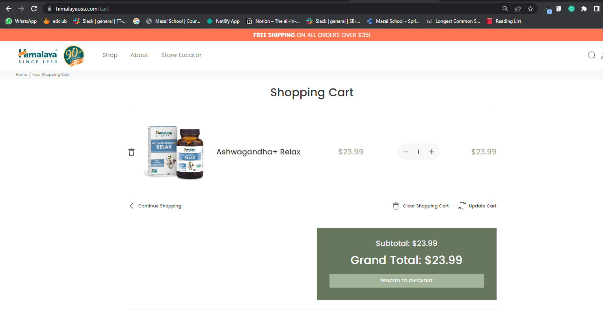

Welcome To Our Project👋

# Project Name - Himalayausa.com
Clone of Himalayausa.com (https://himalayausa.com/)

##Project Holders

1. Manjunath Patil
2. Harshank
3. Noor Mohammed
4. Aman Kumar
5. Shivaji

## About
This project was about creating a clone of  Kindmeal website as the part of construct week project. 

Himalaya offers a full line of clinically-studied herbal formulations, certified USDA organic Single herbs, and a full line of body care products. Integrating the principles of traditional medicine with modern science, Himalaya is a worldwide pioneer in the field of scientifically validated herbal healthcare.  On this website, a user can search and filter for different products and order them.
This project was a result of the collaboration of five team members within five days.

## Tech Stacks used:- 
* HTML

* CSS

* Advanced Javascript

## Project Screenshots

## Project
**Following pages have been implemented in the clone by respective team member**
* Landing Page/Index page & details page- Harshank
* Login, SignUp, Store locator, Product and Cart page - Manjunath Patil
* Each product page - Noor Mohammed
* About page page - Aman Kumar 
* Payment page - Shivaji

### Functionalities :
* Functional navigation bar with user details
* Slide shows on the landing page.
* Login signup functionality for multiple users with the help of local storage.
* User profile updation functionality.
* Product list and add to cart functionality.
* Sorting of products.
* Increase or decrease the number fo iteams and dynamicaly change in price.
* Functionality to order the or make payment for product.

## Netlify link :-

<a href="https://euphonious-bombolone-2aab69.netlify.app/homepage/">http://harmonious-crostata-782582.netlify.app/</a>
